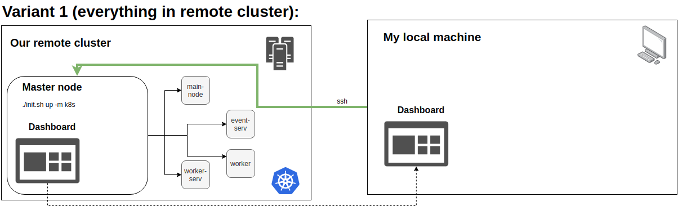
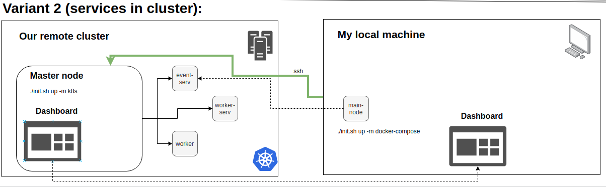
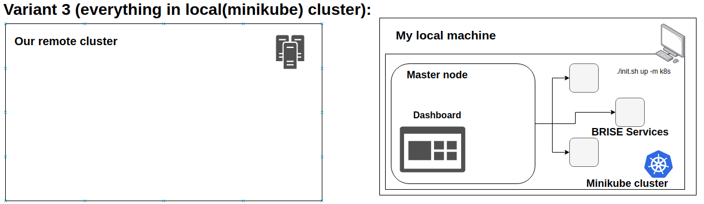

## Using Kubernetes 
To deploy BRISE onto the Kubernetes cluster you can either use our cluster or create your own.

Generally, you should use `brise.sh` with mode `k8s`, and pick which service you want to run. 

Under the hood, the script builds images for specified services, pushes them to specified `docker-hub` 
(should be local to protect private info) and builds relevant `k8s services` (the orchestrator decides where to 
run each service).

After that, you are able to use the services as you want (via the management portal or just by sending requests via `RabbitMQ`).

`NOTE: Because of the DNS problem, during the initialization pods could fail several times.`

Be aware that if you use `brise.sh` control script to deploy BRISE on K8s,
the master-node of your cluster will need to connect to the **local** `Docker hub` where images of BRISE services 
will be stored and the domain name of the `docker hub` in the cluster and on the host machine must be the same.
See details in the use case for `minikube`.

Also, for K8s deployment, user should be authorized to execute `kubectl` commands.

### Use cases
#### Everything in the remote cluster



- Login in the `master-node` via ssh: `ssh user@141.76.65.28`
- Delete existing services: `./brise.sh down -m k8s` 
- Run `./brise.sh up -m k8s`
- Wait until all services will run stable.
- Find the `main-node` pod full name, by using the dashboard or `kubectl get pods`. 
- Run `python3.7 main.py ./relative/path/to/config/file.json` in the `main-node` pod. You can use the dashboard to 
run the command or `kubectl exec -it main-node-xxxxx -- command`.
*May fail a few times because of the DNS problem.*

#### Workers, worker service end the event service in the cluster



- Login in the `master-node` via ssh: `ssh user@141.76.65.28`
- Delete existing services: `./brise.sh down -m k8s`
- Run `./brise.sh up -m k8s -s event_service worker_service worker`
- Wait until services will run stable.
- Bind local ports to the cluster ports where event service runs AMQP and GUI service.
 
    `ssh -L 30153:master-node:30153 user@141.76.65.28` - to bind AMQP port
    `ssh -L 30154:master-node:30154 user@141.76.65.28` - to bind GUI port
    
    The command binds the local `30153` port to the `30153` port on the `master-node` of the cluster. 
- Run the `main-node` service in a local Docker container and specify event service hostname (IP) and ports for AMQP and GUI service:

    `./brise.sh up -m docker-compose -e 127.0.0.1 -eAMQP 30153  -eGUI 30154 -s main-node`

Additionally, for debug purposes you may want to run the `main-node` (or any other service) on the local machine 
without using `brise.sh` and a Docker container.
To do so, specify the next environment variables on your local machine:

 - `BRISE_EVENT_SERVICE_AMQP_PORT` - as AMQP port of RabbitMQ service
 - `BRISE_EVENT_SERVICE_HOST` - as IP or domain name of RabbitMQ service

After that, you can run any services by using python commands.

`NOTE. The host networking driver only works on Linux hosts and is not supported on Docker Desktop for Mac, Docker 
Desktop for Windows, or Docker EE for Windows Server. To test this variant on a Windows machine, you can run 
main-node locally as for debugging purposes.`

#### Everything in the local(minikube) cluster



An important detail, in your cluster and on a machine where you run `brise.sh` the Docker hub hostname must be the same.
Therefore, in the next guide, the DNS name `hub` is used as the Docker hub hostname.

On your local machine:
- Create a minikube cluster according to the guide: https://kubernetes.io/docs/setup/learning-environment/minikube/
- Get a minikube IP. Run `minikube ip`
- Setup an IP for `hub` to the value of `minikube ip` in the DNS records.
- Setup an insecure-registry for your Docker daemon to successfully push images.
    1. Run `sudo systemctl edit docker`.
    2. Set `--insecure-registry` to the minikube IP. An example of the file:
        ```
        [Service]
        ExecStart=
        ExecStart=/usr/bin/dockerd -H fd:// --insecure-registry hub:5000
       ```
     3. Reload the Docker daemon: `systemctl daemon-reload`
     4. Restart Docker `systemctl restart docker`
 - Again run `minikube start` (if it stops because of Docker restart)
 
In the minikube cluster (run `minikube ssh`):
- Install a local Docker hub repository:
    2. Run `docker run -d -p 5000:5000 --restart=always --name registry registry:2`
    3. Setup IP for `hub` as `127.0.0.1` in the DNS records.
    4. Exit from minikube. Run `exit`

On your local machine:
- Use `brise.sh` file to run commands on the machine:
    `./brise.sh up -m k8s --k8s_docker_hub_name hub -s event_service worker_service`


### Some useful commands and information

##### Dashboard related information

Kubernetes Dashboard is already installed in our cluster. To run it use `kubectl proxy` command, 
and the dashboard will be accessible on the `8001` port.

To get access to the GUI of the dashboard, follow the next steps:
 - Connect to the master node of the cluster: `ssh user@141.76.65.28`
 - Run the proxy service: `kubectl proxy`
 - Open the GUI link in your browser. Please note, the dashboard is accessible only locally on the `master-node` 
 on the next address: `http://127.0.0.1:8001/api/v1/namespaces/kubernetes-dashboard/services/https:kubernetes-dashboard:/proxy/`.
 - If you would like to open the dashboard from a remote machine you have to forward the local 
 traffic from the master node. To do it use ssh port binding.
    1. The next command binds 9999 local port with  8001 `master-node` port: 
        `ssh -L 9999:127.0.0.1:8001 user@141.76.65.28`.
    2. After that the dashboard is accessible from your local machine on the next address:
`http://127.0.0.1:9999/api/v1/namespaces/kubernetes-dashboard/services/https:kubernetes-dashboard:/proxy/`
 - To login into the dashboard use a token authorization mechanism. To get the token run the next command:
 `$ kubectl -n kube-system describe secret $(sudo kubectl -n kube-system get secret | 
 (grep k8sadmin || echo "$_") | awk '{print $1}') | grep token: | awk '{print $2}'`
 

##### Cluster management information

The cluster was built by following [the guide](https://www.tecmint.com/install-kubernetes-cluster-on-centos-7/).

To fix some unpredictable network error sometimes it is useful to update IP tables. 
Especially useful when nodes do not "see" each other. Run it on each node.:
```
sudo - s
iptables -P FORWARD ACCEPT
iptables -F && iptables -t nat -F && iptables -t mangle -F && iptables -X
```

To add a new sudo and k8s enabled user for a node, follow the next steps:

 - Create a new user:
    1. `adduser user_name`
    2. `passwd user_name`
    3. `usermod -aG wheel user_name`
 - Test is sudo enabled?
    `su - user_name`

To enable k8s commands for a new user:
 - Under root run (need to be run only once, already done in the cluster):
    1. `mkdir -p $HOME/.kube`
    2. `cp -i /etc/kubernetes/admin.conf $HOME/.kube/config`
    3. `chown $(id -u):$(id -g) $HOME/.kube/config`
 
 - Under a new sudo enabled user run:
    1. `mkdir -p $HOME/.kube`
    2. `sudo cp -i /etc/kubernetes/admin.conf $HOME/.kube/config`
    3. `sudo chown $(id -u):$(id -g) $HOME/.kube/config`