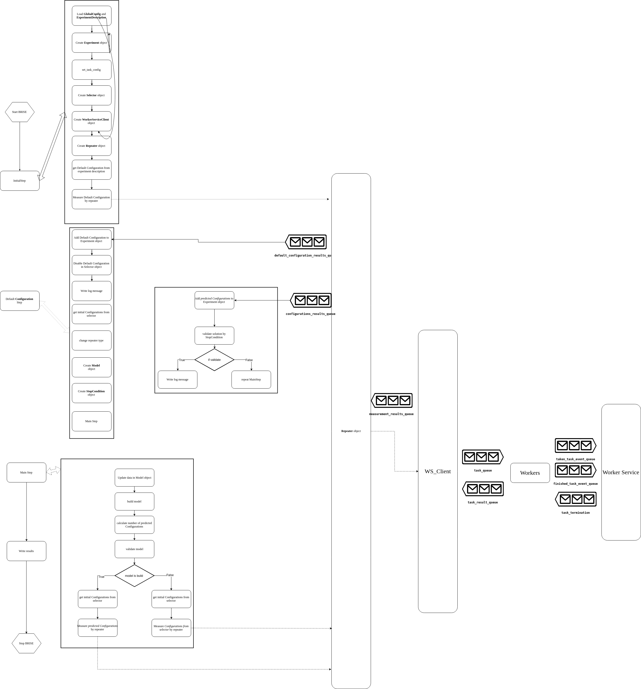
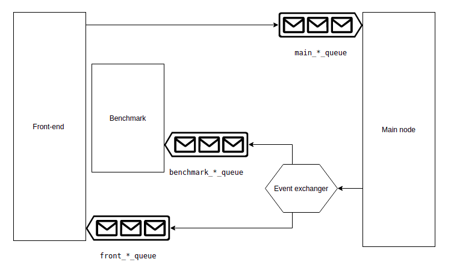

### Events service based on RabbitMQ 

###### This folder contains configuration files for [RabbitMQ service](https://www.rabbitmq.com/)

#### Dependency
Software requirements:
- Docker

### Structure
`./bin` contains two configuration files:
- `./bin/definitions.json` is used for describing all RabbitMq components (e.g. queues, exchanges, bindings, etc.). They will exist immediately after starting RabbitMq.
- `./bin/rabbitmq.config` is used to configure ports and host name for RabbitMQ server.

## Customized components
There is a list of customized components that are described in `./bin/definitions.json`

Queues:
- `task_result_queue`: the queue with task results; connected **workers** and **WS_Client** on the **main-node**.
 Main communication steps relevant to this queue:
    1. A **worker** *enqueues* the results of each finished task into this queue via `task_result_sender`. 
    2. The **WS_Client**  *dequeues* the results as soon as they are available.
    3. The **WS_Client** *collects* all results for specific configuration
    4. The **WS_Client** *enqueues* results of each configuration into the `measurement_results_queue` queue. 
- `task_queue`: the queue with tasks; connected **workers** and **WS_Client** on the **main-node**.
Main communication steps relevant to this queue:
    1. The **WS_Client** *enqueues* as many tasks as repeater decided into this queue. 
    2. A **worker** *dequeues* a task as soon as the task is available and the worker is free
    3. A **worker**  notifies the **Worker Service** that task was taken through `taken_task_event_queue`
    4. A **worker**  gets a result for the task and *enqueues* the result into the `task_result_queue` queue. 
    5. A **worker** notifies the **Worker Service** that the task was finished through `finished_task_event_queue`
    6. A **worker** sends an acknowledgment to the RabbitMQ server that task was correctly processed
- `taken_task_event_queue`: the queue with taken tasks for measuring; connected **workers** and **Worker Service** node. 
Main communication steps relevant to this queue:
    1. A **worker** *enqueues* the task id that was taken for processing into this queue. 
    2. The **Worker Service** *dequeues* a task id as soon as it is available
    3. The **Worker Service** does manage tasks (e.g. managing of the execution time of each task, terminating specific task via sending a termination message to `task_termination_sender`)
- `finished_task_event_queue`: the queue with finished tasks; connected **workers** and **Worker Service** node.
Main communication steps relevant to this queue:
    1. A **worker** *enqueues* the task id that was finished into this queue. 
    2. The **Worker Service** *dequeues* a task id as soon as it is available
    3. The **Worker Service** stops managing the task
- `default_configuration_results_queue`: the queue with the result for **default configuration**; connected **repeater** and the **main** script in the **main-node**.
Main communication steps relevant to this queue:
    1. The **repeater** *enqueues* the result for default configuration into this queue in a case when the **repeater** has enough information about the **default configuration**
    2. The **main** script in the **main-node** *dequeues* the result for **default configuration** as soon as it is available
    3. The **main** script does initialize internal parameters and asks **WS_Client** to measure *N* new configurations, where N is number of **workers**
- `configurations_results_queue`: the queue with the results for all configurations **except default** (default point have to be processed in a different way); connected **repeater** and the **main** script in the **main-node**.
Main communication steps relevant to this queue:
    1. The **repeater** *enqueues* the result for a configuration into this queue in a case when the **repeater** has enough information about the configuration
    2. The **main** script in the **main-node** *dequeues* the result for a configuration as soon as it is available
    3. The **main** checks **stop conditions** 
    4. In a case when **stop conditions** suggest to continue running BRISE, the **main** script sends new configuration for measuring
- `check_stop_condition_expression_queue`: the queue with Stop Condition decision results; connected **stop conditions** and **stop condition validator**.
 Main communication steps relevant to this queue:
    1. A **stop condition** *enqueues* the own decision whether to stop or not current experiment.
    2. The **stop condition validator**  *dequeues* the **stop condition** decision as soon as it is available.
    3. The **stop condition validator** *collects* all decisions from all **stop conditions**
    4. The **stop condition validator** *enqueues* empty message to `stop_experiment_queue` queue if the validation according to expression is passed. 
- `stop_experiment_queue`: the queue with Stop Condition Validator decision about stopping experiment; connected **stop condition validator** and **main-node**.
 Main communication steps relevant to this queue:
    1. A **stop condition validator** *enqueues* the final decision about experiment stopping.
    2. The **main-node**  *dequeues* the **stop condition validator** message as soon as it is available.
    3. The **main-node** *enqueues* empty message to components via `brise_termination_sender` which is used to stop components. 
- *N* queues with "random" name, where *N* is the number of workers: the queues with termination messages; connected **workers** and **Worker Service** node. 
Main communication steps relevant to this queue:
    1. The **Worker Service** *enqueue* a message for workers into those queues via `task_termination_sender`
    2. Each **worker** *dequeue* a message from his own queue as soon as it is available
    3. A **worker** does something depends on the content of a message (e.g. terminates his current execution task)
- `main_start_queue`, `main_status_queue`, `main_stop_queue`, `main_download_dump_queue`, `main_responses`: queues for RPC to the main node. Main communication steps relevant to this queues:
    1. A client sends a request with a unique tag_id, and endpoint to publish results (mostly it is `main responses` queue)
    2. EventAPI on the main node dequeues request messages from those queues and do relevant action
    3. The main node publishes results to specified queue (mostly to `main responses`)
- `front_log_queue`, `front_default_queue`, `front_new_queue`, `front_predictions_queue`, `front_final_queue`, `front_experiment_queue`, `benchmark_final_queue`: queues for sending events from nodes to consumers (e.g. benchmark, front-end). Each client has to have his own *queues* and those queues have to be registered in the specific *exchanger*. To save space and don't store unused messages in this queue message has **time to live** parameter that equal to **a second**. That means that consumer has one second to read a message if consumers don't read, that means that there no consumers and **messages will be deleted**.
Main communication steps relevant to this queues:
    1. A node sends an event message to specific queues via the specific *exchanger*
    2. Consumers get information about an event from their own queues
Exchanges:
- `task_result_sender`: the exchanger used for sending result message to `task_result_queue` and as a finished  event to `finished_task_event_queue`
- `task_termination_sender`: the exchanger used to broadcast termination messages
- `event_log_sender`, `event_default_sender`, `event_new_sender`, `event_prediction_sender`, `event_final_sender`, `event_experiment_sender`: exchangers used to publish event messages to registered clients
- `brise_termination_sender`: the exchanger used for sending stop messages to each BRISE module

### Managing

There are at least two opportunities for managing the RabbitMQ node. First of all, it is a [terminal tool](http://manpages.ubuntu.com/manpages/trusty/man1/rabbitmqctl.1.html), and also more useful **management portal** that is deployed in this node on the 15672 port. 

You are able to use default user for managing. Login - **guest**, password - **guest**. You can easily add a new user via a `./bin/definitions.json` file.
