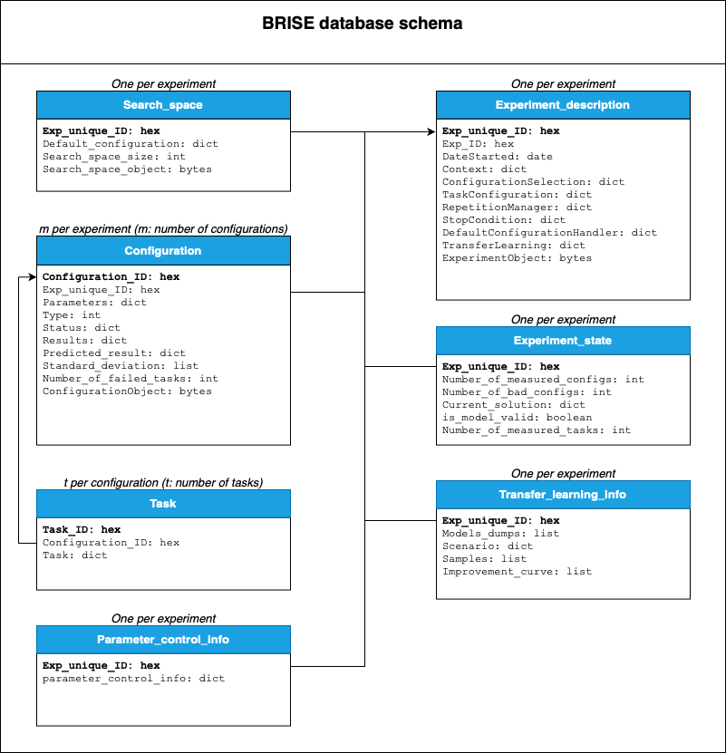

### General information about the database usage in BRISE

BRISE uses [MongoDB](https://www.mongodb.com/), which has a convenient [Python driver](https://api.mongodb.com/python/current/), 
as a database system. 

**The purpose of using the database in BRISE** is to store the states and results of multiple experiments being executed
simultaneosly and to allow BRISE services to exchange their data.

Currently 3 variants of MongoDB location are supported in BRISE:
1. **Local database in container (default)** - if you want to use your own local database, adjust credentials in :
- [LocalDeployment.json](../deployment_settings/LocalDeployment.json) file 
(`"DatabaseUser": "user"`, `"DatabasePass": "yourPassword"`) and 
- [init.js](init.js) file.
2. **Remote database** - if you want to use a remote database, update credentials and IP address in 
[RemoteDeployment.json](../deployment_settings/RemoteDeployment.json) file. Note, that a MongoDB instance should be 
installed on the remote machine first.
3. **Remote database in the k8s cluster** - you may have your MongoDB running in the remote k8s cluster. The 
deployment file is already pre-set for this purpose (see [K8s/mongo-db-deployment.yaml](../K8s/mongo-db-deployment.yaml)). 
Please check the credentials and change the database address in 
[RemoteDeployment.json](../deployment_settings/RemoteDeployment.json) respectively.

The name of the database, its address and port can be customized during the BRISE startup (please, see the 
run options of the `./brise.sh up` command).

#### BRISE database structure

An overview of the information stored in the database is shown in the following diagram:

#### BRISE database clean up

By default the data is being appended to the database as long as the `mongo-db` container exists. 
If you want to clean the database, please, use `./brise.sh clean_database`. The details you may 
find using `./brise.sh help` command.

#### Useful commands
For the debugging purposes you may login to the database server (via SSH) and access the database 
manually using MongoDB console. To run the MongoDB console type `mongo --username database_user --password database_pass 
127.0.0.1/BRISE_db` - please, note that you need to login with the respective credentials 
(see main_node/Resources/SettingsBRISE.json).
When the console is running, switch to the used database with `use database_name` (`database_name`=`BRISE_db` 
by default). Here you can list the collections or perform other actions you may be interested in. Useful mongo 
Shell commands you may find at [mongo Shell Quick Reference](https://docs.mongodb.com/manual/reference/mongo-shell/).
