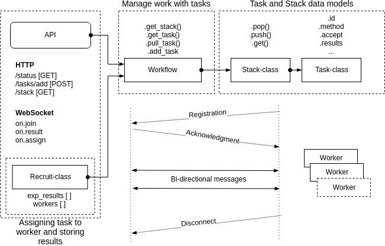

### Service worker

###### This folder consist code that encapsulates logic distribution of tasks between workers

#### Dependancy
Software requirements:
- Docker
- Python 3.6
- [Flask](http://flask.pocoo.org/docs/0.12/ "Flask")
- [flask-socketio](http://flask-socketio.readthedocs.io/en/latest/ "flask-socketio")
- [flask-CORS](https://flask-cors.readthedocs.io/en/latest/ "Flask-CORS")
- [eventlet](http://eventlet.net/doc/index.html/ "eventlet")

- [worker node](Valavanca/benchmark/tree/master/worker/README.md)


___
### API examples
> Tasks are added to the stack for executing on the workers
**POST**  http://0.0.0.0:49153/task/add
##### Variant 1 
```json
[{
    "task_name": "random_1",
    "params": {
        "threads": "1",
        "frequency": "2901.0"
    },
    "Scenario": {
        "ws_file": "Radix-1000mio_avg.csv"
    }
},
{
    "task_name": "random_2",
    "params": {
        "threads": "4",
        "frequency": "1900.0"
    },
    "Scenario": {
        "ws_file": "Radix-1000mio_avg.csv"
    }

}
]
```
##### Variant 2 
```json
{
  "Scenario": {
    "ws_file": "Radix-1000mio_avg.csv"
  },
  "params_names": ["frequency", "threads"],
  "task_name": "random_1",
  "request_type": "send_task",
  "param_values": [
    [2000.0, 4],
    [2500.0, 1],
    [1600.0, 16],
    [1800.0, 2],
    [2800.0, 16]
  ]
}
```
> Response from worker service with identifications of the tasks
```json
{
    "id": [
        "69d0ace386674deebe4ab03420277b24",
        "872cf2531eab41678fa665e15d583bf5",
        "e51ec4fc31ee44ec95c6d9c0867c4efa"
    ],
    "message": "3 task(s) are accepted!",
    "response_type": "send_task",
    "status": "success"
}
```
___

> Get the current stack of tasks for execution on workers
**GET**  http://0.0.0.0:49153/stack
```json 
{
   "data":[
      {
         "config":{
            "ws_file":"Radix-1000mio_avg.csv"
         },
         "id":"2f5cc8997f194ed59a5914b1a2304cb7",
         "meta_data":{
            "accept":"null",
            "appointment":"null",
            "owner":"null",
            "receive":1524572775.4672573,
            "result":"null"
         },
         "run":{
            "method":"random_2",
            "param":{
               "frequency":"1900.0",
               "threads":"4"
            }
         }
      },
      {
         "config":{
            "ws_file":"Radix-1000mio_avg.csv"
         },
         "id":"9b205125281149049d16ba4ce87277b8",
         "meta_data":{
            "accept":"null",
            "appointment":"null",
            "owner":"null",
            "receive":1524572775.4672928,
            "result":"null"
         },
         "run":{
            "method":"random_1",
            "param":{
               "frequency":"2500.0",
               "threads":"2"
            }
         }
      }
   ],
   "status":"success"
}
```
____
**PUT** http://0.0.0.0:49153/result/format
###### Get result from special tasks with required fields
```json
 {
        "task_name": "random_1",
        "request_type": "get_results",
        "response_struct": ["frequency", "threads", "time" ],
        "id": ["510e828e916a4216950ff8e4e7fd190d",
        "88190f6033a3485c9316c871bfe16705",
        "cdfd855509fa4e68ab26a7cc3eaaea1f",
        "17622cef596f47989967869a11e69275",
        "187a647d52e7464fadc8b99419afa40a"]
    }
```
____
> Information about clients, current stack, task results, workers
**GET**  http://0.0.0.0:49153/
___
> Return the current results of the task
**GET**  http://0.0.0.0:49153/result/<id>


