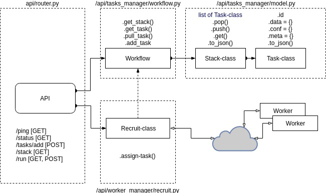

### Service worker

###### This folder consist code that encapsulates logic distribution of tasks between workers

- Dependancy: Python 3.6, [Flask](http://flask.pocoo.org/docs/0.12/ "Flask"), [Requests](http://docs.python-requests.org/en/master/ "Requests"), Docker

- [worker node](Valavanca/benchmark/tree/master/worker/README.md)



### API examples
**POST**  http://0.0.0.0:80/task/add
##### Request V1 
```json
{
  "worker_config": {
    "ws_file": "Radix-1000mio_avg.csv"
  },
  "params_names": ["frequency", "threads"],
  "task_name": "random_1",
  "request_type": "send_task",
  "param_values": [
    [2000.0, 4],
    [2500.0, 1],
    [1600.0, 16],
    [1800.0, 2],
    [2800.0, 16]
  ]
}
```
##### Request V2 
```json
[{
		"task_name": "random_1",
		"params": {
			"threads": "1",
			"frequency": "2901.0"
		},
		"worker_config": {
			"ws_file": "Radix-1000mio_avg.csv"
		}

	},
	{
		"task_name": "random_2",
		"params": {
			"threads": "4",
			"frequency": "1900.0"
		},
		"worker_config": {
			"ws_file": "Radix-1000mio_avg.csv"
		}

	}
]
```
##### Response
```json
{
    "id": [
        "69d0ace386674deebe4ab03420277b24",
        "872cf2531eab41678fa665e15d583bf5",
        "e51ec4fc31ee44ec95c6d9c0867c4efa"
    ],
    "message": "3 task(s) are accepted!",
    "response_type": "send_task",
    "status": "success"
}
```
___

**GET**  http://0.0.0.0:80/stack
##### Get the current stack for execution
```json 
{
    "data": [
        {
            "config": {
                "ws_file": "Radix-1000mio_avg.csv"
            },
            "id": "2f5cc8997f194ed59a5914b1a2304cb7",
            "meta_data": {
                "accept": "null",
                "appointment": "null",
                "owner": "null",
                "receive": 1524572775.4672573,
                "result": "null"
            },
            "run": {
                "method": "random_2",
                "param": {
                    "frequency": "1900.0",
                    "threads": "4"
                }
            }
        },
        {
            "config": {
                "ws_file": "Radix-1000mio_avg.csv"
            },
            "id": "9b205125281149049d16ba4ce87277b8",
            "meta_data": {
                "accept": "null",
                "appointment": "null",
                "owner": "null",
                "receive": 1524572775.4672928,
                "result": "null"
            },
            "run": {
                "method": "random_1",
                "param": {
                    "frequency": "2500.0",
                    "threads": "2"
                }
            }
        }
    ],
    "status": "success"
}
```
____
**PUT** http://0.0.0.0:80/result/format
###### Get result from special tasks with required fields
```json
 {
        "task_name": "random_1",
        "request_type": "get_results",
        "response_struct": ["frequency", "threads", "time" ],
        "id": ["510e828e916a4216950ff8e4e7fd190d",
        "88190f6033a3485c9316c871bfe16705",
        "cdfd855509fa4e68ab26a7cc3eaaea1f",
        "17622cef596f47989967869a11e69275",
        "187a647d52e7464fadc8b99419afa40a"]
    }
```
____
**GET**  http://0.0.0.0:80/result/<id>
###### Return the current state of the task

